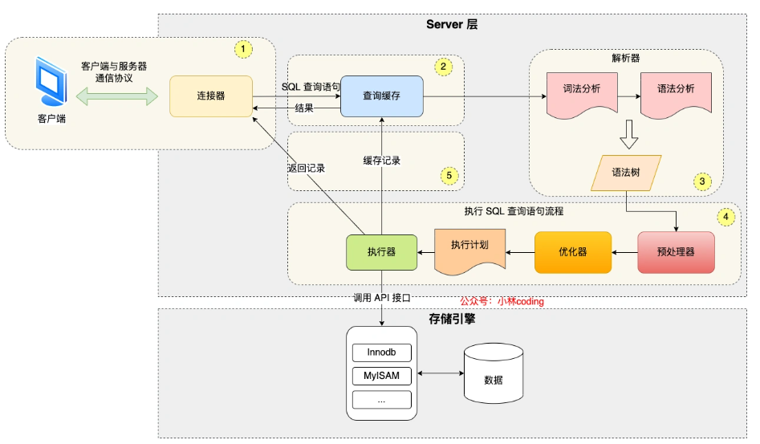

## 1.0 MySQL基础

### 1.0.1 概念与术语

MySQL是最流行的关系型数据库管理系统，是按照数据结构来组织、存储和管理数据的仓库。所谓的关系型数据库，是建立在关系模型基础上的数据库，借助于集合代数等数学概念和方法来处理数据库中的数据。

相关术语如下：
- 数据库：数据库是关联表的集合。
- 数据表：表是数据的矩阵。
- 列：包含了相同类型的数据。
- 行：一行也成为一个元组或一条记录，是一组相关的数据。
- 冗余：冗余指相同信息的数据在数据库中重复存储，可以通过关联多个表减少冗余，但是冗余也有处于安全的考虑，并非需要完全杜绝。
- 主键：主键唯一，一个数据表中只能包含一个主键，可以使用主键查询数据。
- 外键：外键用于关联两个表。
- 复合键：将多个列作为一个索引键，一般用于复合索引。
- 索引：索引是对数据库表中一列或多列的值进行排序的一种结构。
- 参照完整性：

### 1.0.2 SQL语句

#### 1.0.2.1 数据库操作
1. 创建数据库
   
   ```sql
   CREATE DATABASE 数据库名
   ```
2. 删除数据库
   
   ```sql
    DROP DATABASE 数据库名
   ```

#### 1.0.2.2 数据表操作
1. 创建数据表
   
   ```sql
   CREATE TABLE table_name (column_name column_type)
   ```
2. 

## 1.1 MySQL流程与组成部分

### 1.1.1 执行一条select语句，期间发生了什么？

完整的流程与模块如图所示：


#### 1.1.1.1 MySQL的架构

MySQL架构分成两层，Server层和存储引擎层：
1. Server层
   
   Server层负责简历连接、分析和执行SQL，大多数核心功能模块都在这一层实现，主要包括连接器、查询缓存、解析器、预处理器、优化器、执行器等。另外，所有的内置函数（日期、时间、数学和加密函数）和所有的跨存储引擎功能（存储过程、触发器、视图等）都在Server层实现。

2. 存储引擎层

    存储引擎层负责数据的存储和提取，支持InnoDB\MyISAM\Memory等多个存储引擎，不同的存储引擎公用一个Server层。从MySQL5.5版本开始，InnoDB成为了MySQL的默认存储引擎，其支持索引类型是B+树，也就是说数据表中创建的主键索引和二级索引默认使用B+树索引。

#### Step 1. 连接器
客户端首先需要和MySQL服务器建立连接，然后才能执行SQL语句。连接过程需要经过TCP三次握手，因为MySQL是基于TCP协议进行传输的。

如果连接没有问题，连接器会验证用户名和密码，用户名和密码都正确，连接器就会获取该用户的权限，然后保存，后续该用户在此连接里的任何操作，都会基于连接开始时的权限进行权限逻辑的判断。

所以也就说明，即使管理员中途修改了该用户的权限，修改完成只有再建立新的连接才会使用新的权限设置。

> 如何查看MySQL服务有多少连接？
> show processlist

同时，MySQL服务器定义了空闲链接的最大空闲时长，由wait_timeout参数控制，默认是8小时，如果空闲时间超过该时间，连接器就会自动断开。

> MySQL的连接数有限制吗？
> 通过max_connections参数控制。

连接器的工作总结：
1. 与客户端进行TCP三次握手建立连接
2. 校验客户端的用户名和密码
3. 读取用户权限，后续命令都基于此权限

#### Step 2. 查询缓存
连接器工作完成后，客户端就可以向MySQL服务发送SQL语句，之后会解析SQL语句的第一个字段。

如果是select语句，MySQL就会先去查询缓存中查找缓存数据，其中查询缓存是以key-value形式保存在内存中的，key为SQL查询语句，value为SQL语句查询结果。

但是查询缓存在MySQL8.0版本后就删掉了，这里的查询缓存是Server层的查询缓存。

#### Step 3. 解析SQL

在正式执行SQL查询语句前，MySQL会对SQL语句做解析，这个工作交给解析器来完成。

解析器做了两件事情：
1. 语法分析
   
   MySQL会根据输入的字符串识别关键字，构建SQL语法树。

2. 语法检查
   
   根据语法分析的结果，语法解析器会根据语法规则，判断是否满足MySQL语法。

#### Step 4. 执行SQL

1. 预处理阶段
   1. 检查SQL查询语句中的表或字段是否存在。
   2. 将select \* 中的 \*符号扩展为表上的所有列。
2. 优化阶段
   1. 优化器负责将SQL查询语句的执行方案确定下来，如果表中有多个索引，优化器会基于查询成本考虑，来决定选择使用哪个索引。
   
3. 执行阶段
   1. 经历完优化器，工作就是由执行器完成的。在执行过程中，执行器会和存储引擎交互，交互是以记录为单位的。
   2. 交互过程有以下三种：
        - 主键索引查询
        - 全表扫描
        - 索引下推