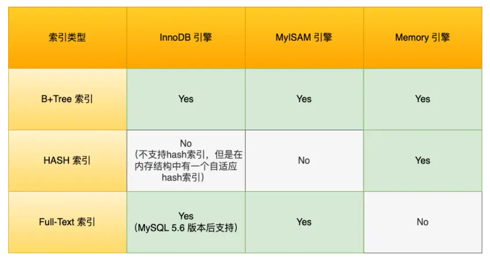

## 2.2 索引的分类

### 2.2.1 按照数据结构分类
每一种存储引擎支持的索引类型不相同，总结如下：

1. B+ tree索引
   
   B+ Tree是一种多叉树，叶子节点才存放数据，非叶子节点只存放索引，而且每个节点里的数据是按主键顺序存放的。每一层父节点的索引值都会出现在下层子节点的索引值中，因此在叶子节点中，包括了所有的索引值信息，并且每一个叶子节点都指向下一个叶子节点，形成一个链表。

   B+ Tree存储千万级的数据只需要3-4层高度就可以满足，这意味着从千万级的表查询目标数据最多需要3-4次磁盘I/O，所以B+Tree 相比于B树和二叉树来说，最大的优势在于查询效率很高，因为即使在数据量很大的情况，查询一个数据的磁盘I/O依然维持在3-4次。
2. Hash索引
3. Full-text索引

### 2.2.2 按照物理存储分类
1. 主键索引
2. 二级索引

### 2.2.3 按照字段特性分类
1. 主键索引
2. 唯一索引
3. 普通索引
4. 前缀索引

### 2.2.4 按照字段个数分类
1. 单列索引
2. 联合索引